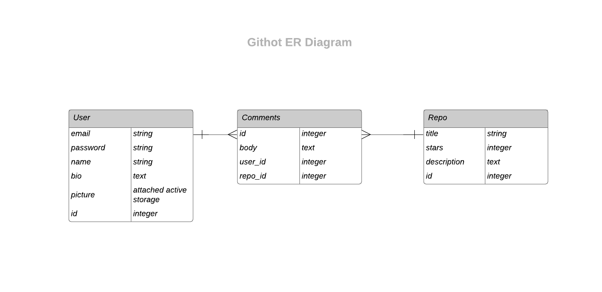

# GitHot - Rails Hackathon Project

By [Morgan Webb](https://github.com/morganw-code), [Hugh Greethead](https://github.com/HughG-50) and [Aaron Lewis](https://github.com/AaronL1011).

View the live application at [githot.herokuapp.com](http://githot.herokuapp.com/)

## Overview

GitHot is a web application built in Rails for the tracking and discussion of recent trending repositories on Github. 

GitHot makes use of the Github search API, returning the top 10 most starred repositories made in the past week. Users of GitHot can view details of the repository, like and engage in discussions about the repository by making comments.

GitHot periodically makes calls to the GitHub API each week to keep the Repository listings up to date.

## Design

### Ideas

- Forum Engine
- Github API

### Scope

A simple web app that utilises the github search API to display the most popular repos of the past (day/week/month/year?) and provides a simple forum interface to discuss each repo.

### Requirements

Github API Integration

Repos
- title:string
- description:text
- stars:int

Users
- email:string
- password:string
- name:string
- description/bio:text
- profile_picture:active_storage

Comments
- user:references
- body:text

### Optional Extras

- Replies System
- Comment Like System

### ERD 

